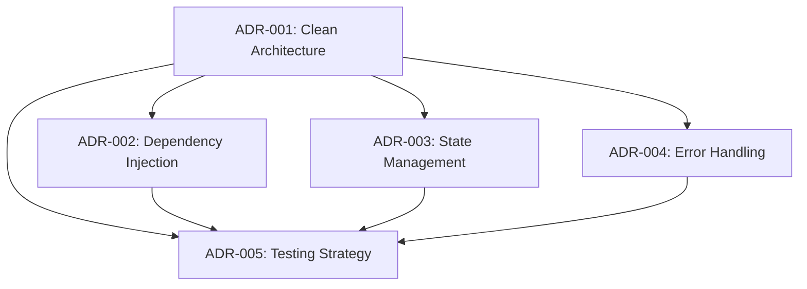

# Architectural Decision Records (ADRs)

This directory contains Architectural Decision Records (ADRs) for the Trackwise application migration from FlutterFlow to Clean Architecture.

## What are ADRs?

Architectural Decision Records document important architectural decisions made during the project, including:
- **Context:** What is the issue we're addressing?
- **Decision:** What decision did we make?
- **Consequences:** What are the positive, negative, and neutral outcomes?
- **Alternatives:** What other options did we consider and why were they rejected?

ADRs help:
- New team members understand architectural choices
- Preserve the reasoning behind decisions
- Avoid revisiting settled decisions
- Document trade-offs and constraints

## ADR Index

### Core Architecture Decisions

| ADR | Title | Status | Date | Summary |
|-----|-------|--------|------|---------|
| [001](001-clean-architecture-adoption.md) | Clean Architecture Adoption | Accepted | 2026-01-03 | Adopt three-layer clean architecture (Presentation → Domain ← Data) for maintainability, testability, and flexibility |
| [002](002-dependency-injection-with-getit.md) | Dependency Injection with GetIt | Accepted | 2026-01-03 | Use GetIt + Injectable for dependency injection with code generation |
| [003](003-state-management-with-bloc.md) | State Management with BLoC | Accepted | 2026-01-03 | Use BLoC pattern (flutter_bloc) for presentation layer state management |
| [004](004-error-handling-with-dartz.md) | Error Handling with Dartz | Accepted | 2026-01-03 | Use Dartz Either<Failure, Success> for functional error handling across layers |
| [005](005-testing-strategy.md) | Testing Strategy | Accepted | 2026-01-03 | Implement testing pyramid (70% unit, 25% widget, 5% integration) with 75%+ coverage target |

## ADR Status Definitions

- **Proposed:** Decision under consideration
- **Accepted:** Decision approved and being implemented
- **Deprecated:** Decision no longer valid but kept for historical reference
- **Superseded:** Replaced by a newer ADR (link to new ADR)

## Decision Dependencies



**Core Decision:** ADR-001 (Clean Architecture) enables all other architectural decisions.

## Key Architectural Principles

Based on the accepted ADRs, the Trackwise architecture follows these principles:

### 1. Separation of Concerns (ADR-001)
- **Presentation:** UI and user interactions (BLoC + Widgets)
- **Domain:** Business logic (Use Cases + Entities)
- **Data:** External data sources (Repositories + Data Sources)

### 2. Dependency Inversion (ADR-001, ADR-002)
- Inner layers define interfaces
- Outer layers provide implementations
- Dependencies point inward (Presentation → Domain ← Data)
- GetIt provides runtime dependency injection

### 3. Functional Error Handling (ADR-004)
- Exceptions thrown in Data layer
- Failures returned in Domain/Presentation layers
- Either<Failure, Success> for type-safe error handling
- Compile-time enforcement of error handling

### 4. Reactive State Management (ADR-003)
- Events in, States out (BLoC pattern)
- Business logic separate from widgets
- Stream-based reactive updates
- Testable presentation logic

### 5. Comprehensive Testing (ADR-005)
- Test pyramid: 70% unit, 25% widget, 5% integration
- Mock-based isolation testing
- 75%+ coverage target
- TDD encouraged but not mandated

## Technology Stack

Based on ADR decisions:

| Layer | Technologies |
|-------|-------------|
| **State Management** | flutter_bloc (ADR-003) |
| **Dependency Injection** | GetIt + Injectable (ADR-002) |
| **Error Handling** | Dartz (ADR-004) |
| **Testing** | mockito, bloc_test, flutter_test (ADR-005) |
| **Backend** | Firebase (Firestore, Auth, Crashlytics, Analytics) |
| **Utilities** | Equatable, intl, json_serializable |
| **Charts** | fl_chart |
| **Privacy** | markdown_widget |

## Creating a New ADR

When making a significant architectural decision:

1. **Copy the template:**
   ```bash
   cp template.md XXX-your-decision-title.md
   ```

2. **Fill in the sections:**
   - Update the header (status, date, title)
   - Describe the context (what problem are we solving?)
   - State the decision clearly
   - Document consequences (positive, negative, neutral)
   - List alternatives considered and why rejected
   - Add references and related ADRs

3. **Submit for review:**
   - Create PR with the new ADR
   - Discuss with team
   - Update status once approved

4. **Update this README:**
   - Add entry to ADR Index table
   - Update dependency graph if needed

## When to Create an ADR

Create an ADR when making decisions that:
- ✅ Affect system structure or architecture
- ✅ Impact multiple features or components
- ✅ Involve technology/framework choices
- ✅ Establish patterns or conventions
- ✅ Have significant trade-offs
- ✅ Are difficult or expensive to reverse

Don't create an ADR for:
- ❌ Implementation details within a single feature
- ❌ Obvious or trivial decisions
- ❌ Temporary workarounds
- ❌ Day-to-day coding choices

## Historical Context

### Migration from FlutterFlow

These ADRs document the migration from FlutterFlow-generated code to Clean Architecture:

**Before (FlutterFlow):**
- Low-code platform with auto-generated Flutter code
- Tight coupling between UI, logic, and data
- Direct Firebase calls in widgets
- 0 tests, 1000+ analysis warnings
- Difficult to extend with custom features (ESP32 Bluetooth)

**After (Clean Architecture):**
- Layered architecture with clear boundaries
- Testable components at every layer
- Type-safe error handling
- 67+ tests with 75%+ coverage target
- Flexible, maintainable, scalable codebase

**Migration Timeline:**
- **Week 1 (Tasks 001-006):** Foundation (architecture setup, DI, testing infrastructure, ADRs)
- **Week 2-8 (Tasks 007-041):** Feature migration (Items, Bluetooth, Events, Export, Auth, Profile)
- **Week 9 (Tasks 042-047):** Cleanup, testing, deployment

## References

- [Documenting Architecture Decisions - Michael Nygard](https://cognitect.com/blog/2011/11/15/documenting-architecture-decisions)
- [ADR GitHub Organization](https://adr.github.io/)
- [Architecture Decision Record Template](https://github.com/joelparkerhenderson/architecture-decision-record)
- [Clean Architecture by Robert C. Martin](https://blog.cleancoder.com/uncle-bob/2012/08/13/the-clean-architecture.html)

## Maintenance

This directory should be:
- ✅ Kept up-to-date as decisions evolve
- ✅ Reviewed during onboarding of new team members
- ✅ Referenced during architectural discussions
- ✅ Used to justify design choices in code reviews
- ❌ Never deleted (even deprecated ADRs provide historical context)

---

**Last Updated:** 2026-01-03
**Maintained By:** Development Team
